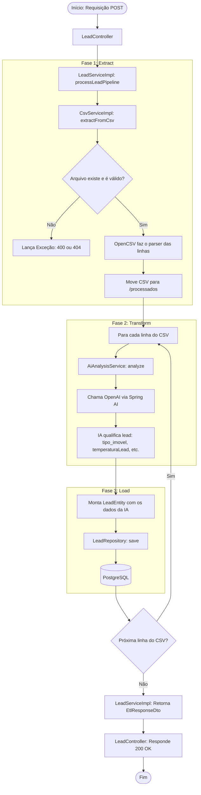

# Guia: Padrão Service/ServiceImpl & Funcionamento do Pipeline ETL

Este documento explica o padrão de projeto **Interface-Implementação (Service/ServiceImpl)** utilizado no backend Java/Spring Boot e detalha o funcionamento prático do método `processLeadPipeline()` com um diagrama de processos (BPM).

---

## 1. O Padrão Service / ServiceImpl

No desenvolvimento corporativo com Java/Spring, é uma convenção separar a **definição do contrato** da sua **implementação concreta**.

```
             ┌──────────────────────┐
             │      Interface       │
             │    (LeadService)     │
             └──────────┬───────────┘
                        │
                        ▼ (implementa)
             ┌──────────────────────┐
             │  Classe Concreta     │
             │   (LeadServiceImpl)  │
             └──────────────────────┘
```

### Por que fazemos isso?
1. **Desacoplamento:** O seu controller (`LeadController`) não precisa saber *como* o pipeline funciona por dentro; ele apenas conhece a interface e confia que o método existe.
2. **Injeção de Dependências:** O Spring pode injetar a implementação automaticamente em tempo de execução.
3. **Fácil de Testar:** Ao criar testes unitários, podemos substituir (`mockar`) o `LeadService` sem precisar instanciar toda a complexidade do pipeline ou chamar APIs reais.

---

## 2. O Método `processLeadPipeline` Passo a Passo

O método `processLeadPipeline` na classe `LeadServiceImpl` é o **orquestrador central**. Ele junta a leitura do arquivo, a chamada para a OpenAI e o salvamento no banco de dados em uma única transação (`@Transactional`).

### Diagrama de Processo (BPM)
Este diagrama demonstra o ciclo de vida de uma requisição que entra na API até a gravação final:



---

## 3. Exemplo Prático de Execução

Imagine que você tem o seguinte arquivo `leads.csv` na pasta `data/input/`:

```csv
id,inputUser
,Oi! Quero comprar um apartamento de R$ 350.000,00 aceitando financiamento.
```

### O que acontece em cada camada:

#### 1. Controller recebe a chamada
O cliente faz a requisição. O `LeadController` recebe e aciona o pipeline:
```java
@PostMapping("/process")
public ResponseEntity<EtlResponseDto> processLeads() throws Exception {
    EtlResponseDto response = leadService.processLeadPipeline(); // <--- Gatilho
    return ResponseEntity.ok(response);
}
```

#### 2. Fase de Extração (Extract)
O `CsvServiceImpl` lê o CSV usando OpenCSV e converte a linha em um DTO temporário:
```java
// Gerado na memória:
LeadRoleDto[id=null, inputUser="Oi! Quero comprar um apartamento de R$ 350.000,00 aceitando financiamento."]
```
Em seguida, ele move o arquivo físico de `data/input/leads.csv` para `data/processados/leads.csv`.

#### 3. Fase de Transformação (Transform)
O `AiAnalysisService` recebe o DTO e faz a pergunta à OpenAI com o System Prompt estruturado. A OpenAI responde exatamente com este JSON:
```json
{
  "tipoImovel": "Apartamento",
  "orcamentoEstimado": "R$ 350.000,00",
  "condicoesEspeciais": "Aceita financiamento",
  "temperaturaLead": "HOT"
}
```
O Spring AI converte isso automaticamente no record `LeadAiResponseDto`.

#### 4. Fase de Carregamento (Load)
O `LeadServiceImpl` monta a entidade JPA final unindo os dados e salva no PostgreSQL:
```java
LeadEntity entity = LeadEntity.builder()
    .id(null) // JPA gerará o UUID automaticamente
    .mensagemOriginal("Oi! Quero comprar...")
    .tipoImovel("Apartamento")
    .orcamentoEstimado("R$ 350.000,00")
    .condicoesEspeciais("Aceita financiamento")
    .temperaturaLead(LeadScore.HOT)
    .build();

leadRepository.save(entity); // <--- Persiste no Postgres
```

#### 5. Resposta enviada
O pipeline encerra e retorna o JSON de resposta para o cliente com status `200 OK`:
```json
{
  "conversaId": "d04a6c8e-a23d-42bc-9d0b-8d055a45214c", // UUID gerado pelo JPA
  "mensagemOriginal": "Oi! Quero comprar um apartamento de R$ 350.000,00 aceitando financiamento.",
  "temperaturaLead": "HOT",
  "status": "Processado com sucesso"
}
```
