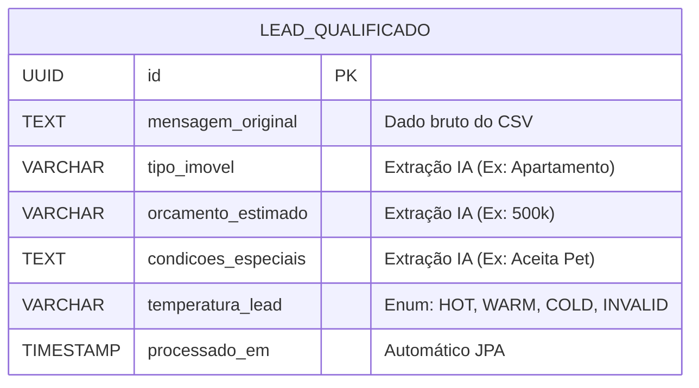

# ⚡ AiDrive ETL – AI-Driven Lead Qualification Pipeline


Uma Prova de Conceito (PoC) arquitetural de um pipeline ETL corporativo focado em ingerir, analisar e persistir mensagens desestruturadas. O motor utiliza **Inteligência Artificial (Spring AI + OpenAI)** para extrair dados estruturados de textos livres e classificar intenções de compra, demonstrando como automatizar fluxos de qualificação de vendas com alta confiabilidade.

---

## 🎯 O Problema de Negócio

Equipes comerciais perdem centenas de horas operacionais analisando mensagens desestruturadas e qualificando leads manualmente. Este projeto resolve essa dor atuando como um "pré-corretor autônomo": ele consome arquivos CSV brutos, processa a linguagem natural de cada mensagem via LLMs, e entrega para a equipe de vendas uma lista filtrada no banco de dados, separando curiosos de compradores reais.

---

## 💡 Destaques de Engenharia (Tech Highlights)

Este repositório foi construído visando padrões de mercado para sistemas de alta disponibilidade:

- **LLMOps & Prompt Engineering:** uso do `Spring AI` com *System Prompts* restritivos e temperatura zerada para evitar alucinações da IA, forçando retornos em JSON mapeados diretamente para DTOs imutáveis (`records`).
- **Arquitetura Desacoplada (SOLID):** separação rigorosa entre a ingestão de dados (`OpenCSV`), o motor de inteligência e a camada de persistência (`Spring Data JPA`).
- **Resiliência e Contratos Claros:** tratamento global de exceções via `@RestControllerAdvice`, garantindo que falhas de negócio ou de infraestrutura retornem payloads JSON padronizados e códigos HTTP semânticos (400, 404, 500).
- **Gestão de Estado Segura:** movimentação atômica do arquivo original para diretórios de arquivamento (`/processados`) após o sucesso da operação, prevenindo duplicidade de ingestão.

---

## 🏗️ Arquitetura de Integração (Fluxo de Dados)

```mermaid
graph TD
    A[Início: POST /api/leads/process] -->|Aciona o Pipeline| B(Controller)

    subgraph fase1 [Fase 1: Extract]
        B --> C[CsvService]
        C -->|Valida & Lê| D[data/input/leads.csv]
    end

    subgraph fase2 [Fase 2: Transform (IA)]
        C -->|LeadRoleDto| E[AiAnalysisService]
        E -->|System Prompt| F((OpenAI API))
        F -->|JSON: LeadAiResponseDto| E
    end

    subgraph fase3 [Fase 3: Load]
        E -->|LeadEntity| G[LeadRepository]
        G -->|Persiste| H[(PostgreSQL)]
    end

    H -->|Sucesso| I[Move CSV para /processados]
    I --> J[Fim: 200 OK - Resumo da Operação]
```

---

## 📊 Modelo de Dados

Toda a operação se condensa em uma estrutura otimizada de persistência (`tb_leads_qualificados`), preparada para indexação e consultas analíticas:



---

## 🚀 Como Executar Localmente (Guia Rápido)

A infraestrutura foi desenhada para ser reproduzida rapidamente em qualquer ambiente de desenvolvimento.

### 1. Requisitos Prévios

- Java 17+ instalado
- Maven
- Docker & Docker Compose
- Chave de API válida da OpenAI

### 2. Passo a Passo

**Suba a infraestrutura do banco de dados (PostgreSQL):**

```bash
docker-compose up -d
```

**Crie os diretórios de processamento na raiz do projeto e insira um arquivo de teste:**

```bash
mkdir -p data/input
mkdir -p data/processados
# Insira um arquivo leads.csv válido dentro de data/input/
```

**Exporte sua chave da OpenAI como variável de ambiente:**

```bash
export OPENAI_API_KEY="sk-sua_chave_aqui"
```

**Inicie a aplicação:**

```bash
mvn spring-boot:run
```

**Acione o pipeline via terminal:**

```bash
curl -X POST http://localhost:8080/api/leads/process
```

---

## 👤 Autor

**Desenvolvido por [Luis Henrique Costa Dias](https://github.com/yDevLuisDias)** — Engenheiro de Software | Data & AI
